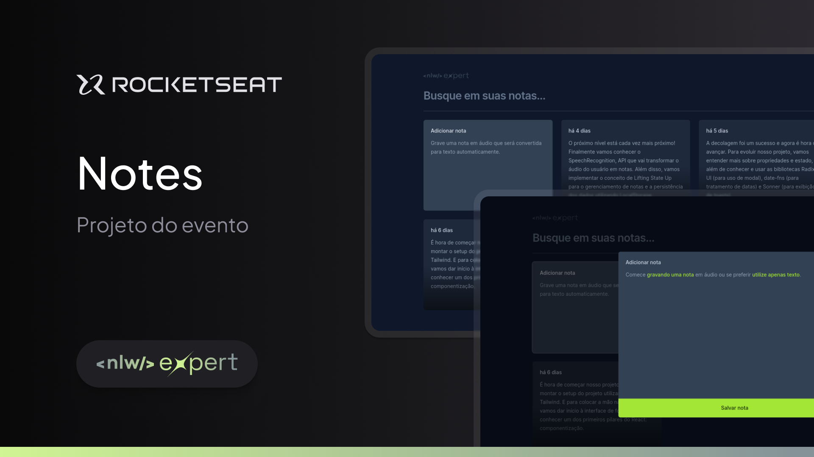

# NLW Expert - Trilha React

Essa aplicação foi desenvolvida durante o NLW Experts da Rocketseat utilizando React, TypeScript, Tailwind e a SpeechRecognition API.

## Tecnologias Utilizadas

- [Vite](https://vitejs.dev)
- [React](https://react.dev)
- [TypeScript](https://www.typescriptlang.org)
- [TailwindCSS](https://tailwindcss.com)
- [SpeechRecognition API](https://developer.mozilla.org/en-US/docs/Web/API/SpeechRecognition)

